# DECK MASTER — Projeto Orientado a Objetos (FAESA — 2025.2)

> **Arquivo-fonte do trabalho.** Todo o conteúdo textual está aqui. Os `.docx` gerados
> (`DeckMaster-PropostaTrabalhoPratico.docx` e `DeckMaster-EspecificacaoProjetoOO.docx`)
> saem deste arquivo. Os diagramas estão em Mermaid — cole em <https://mermaid.live>,
> exporte PNG/SVG e substitua os quadros correspondentes no Word.
>
> **PENDÊNCIAS (o que falta você fazer):** ver a seção final "O QUE AINDA FALTA".

---

# PARTE 1 — PROPOSTA DE TRABALHO PRÁTICO

## Componentes do Grupo (máximo de 5 alunos)

1. Gabriel Dazilio Fanchiotti

> O template fixa apenas um **máximo** de 5 alunos; não há mínimo, e a instrução do Moodle
> ("basta que um aluno do grupo faça a postagem") também não exige dupla. Trabalho individual.

## Sistema/Jogo Proposto

**Deck Master — Jogo Digital de Cartas Colecionáveis Competitivo**

## Organização

**Mesa Viva Studio Ltda.** — estúdio independente de desenvolvimento e operação de jogos
digitais. A área de negócio atendida é a de **jogos digitais competitivos online (games as
a service)**, que envolve a produção e a curadoria de conteúdo (cartas e expansões), a
operação da economia virtual (venda e abertura de pacotes), a condução das partidas online
entre jogadores e a administração das temporadas competitivas e do ranking.

## Endereço

Av. Nossa Senhora da Penha, 1495 — Sala 802, Ed. Trade Center
Bairro Santa Lúcia — Vitória/ES — CEP 29056-243

## Usuário

| Campo | Conteúdo |
|---|---|
| Nome | Mário de Souza — Gerente de Produto da Mesa Viva Studio |
| Telefones | (27) 3222-1188 / (27) 99988-7766 |
| E-mail | mario.souza@mesavivastudio.com.br |

> **Trocar pelos dados reais** se a professora cobrar cliente/usuário verdadeiro.

## Descrição do Mini-mundo (escopo do jogo)

Deck Master é um jogo digital de cartas colecionáveis no qual duas pessoas se enfrentam em
partidas de turnos alternados, cada uma utilizando um conjunto de cartas de sua propriedade
montado previamente, chamado de deck. O jogo funciona de forma contínua, como um serviço
online: as pessoas mantêm uma conta pessoal, acumulam cartas ao longo do tempo, montam e
remontam seus decks e disputam partidas contra outras pessoas conectadas.

Para começar a jogar, a pessoa cria uma conta informando um apelido, seu nome completo, seu
e-mail, sua data de nascimento e seu endereço, e recebe uma quantidade inicial de cristais,
que é a moeda usada dentro do jogo, e um conjunto básico de cartas. Cada carta pertence a
uma expansão, tem uma raridade (comum, incomum, rara, épica ou lendária), está associada a
um ou mais elementos e é de um dos três tipos existentes: criatura, feitiço ou terreno. As
criaturas possuem valores de ataque e defesa e permanecem em campo; os feitiços produzem um
efeito imediato ou contínuo e são descartados; os terrenos geram os recursos que permitem
pagar o custo de invocação das demais cartas.

A coleção de uma pessoa é o conjunto de cartas que ela possui, com a quantidade de cópias de
cada uma. Novas cartas são obtidas comprando pacotes com cristais e abrindo esses pacotes:
cada pacote entrega uma quantidade fixa de cartas sorteadas conforme a probabilidade
associada a cada raridade. Cartas repetidas além do limite permitido podem ser convertidas
em fragmentos, que servem para fabricar cartas específicas que a pessoa ainda não possui.

A partir da coleção, a pessoa monta seus decks. Um deck tem um nome, pertence a um formato de
jogo e só é considerado válido quando respeita as regras do formato: quantidade mínima e
máxima de cartas e número máximo de cópias da mesma carta. Uma pessoa pode manter vários
decks salvos e escolher qual deles levará para cada partida.

As partidas podem ser casuais ou ranqueadas. Ao solicitar uma partida, a pessoa entra em uma
fila de espera até que um oponente compatível seja encontrado; a partir daí a partida é
iniciada e os dois lados jogam em turnos alternados. Em seu turno, quem está ativo compra
uma carta, acumula recursos e realiza jogadas: invocar criaturas, lançar feitiços, posicionar
terrenos e atacar o oponente. Cada pessoa começa com uma quantidade fixa de pontos de vida, e
a partida termina quando os pontos de vida de um dos lados chegam a zero, quando alguém se
rende ou quando o tempo limite é atingido. Uma partida pode ainda ser pausada por tempo
limitado e cancelada caso nenhum oponente seja encontrado.

O jogo é organizado em temporadas com data de início e fim. Nas partidas ranqueadas, o
resultado altera a pontuação da pessoa na temporada corrente: vitórias somam pontos e
derrotas subtraem. A pontuação define a divisão em que a pessoa está (bronze, prata, ouro,
diamante ou mestre) e sua posição no ranking geral. Ao final da temporada, o ranking é
encerrado, as recompensas são distribuídas conforme a divisão alcançada e uma nova temporada
começa.

A curadoria do conteúdo é feita pelo administrador do jogo, responsável por cadastrar novas
cartas, expansões, raridades, elementos, formatos e pacotes, por abrir e encerrar temporadas
e por acompanhar o histórico de partidas.

## Objetivos a serem atendidos pelo jogo

- Proporcionar partidas competitivas de cartas por turnos entre dois jogadores online, com
  regras claras, aplicadas automaticamente e iguais para os dois lados.
- Estimular a permanência do jogador por meio do colecionismo: uma coleção pessoal que cresce
  de forma progressiva e é preservada entre sessões.
- Oferecer profundidade estratégica na construção de decks, com validação automática das
  regras de cada formato, sem exigir que o jogador memorize as restrições.
- Garantir progressão mensurável e justa através de temporadas, pontuação, divisões e ranking
  público.
- Sustentar a economia virtual do jogo (cristais, pacotes e fragmentos) de forma equilibrada
  e auditável.
- Assegurar que nenhum progresso seja perdido: coleção, decks, histórico de partidas e
  pontuação persistem e são recuperáveis por backup.
- Impedir acesso indevido à conta e às cartas de terceiros por meio de identificação,
  autenticação e autorização.

## Principais Funções

- Cadastrar Jogador
- Efetuar Logon no Sistema
- Manter Perfil do Jogador
- Cadastrar Carta
- Cadastrar Expansão
- Cadastrar Raridade
- Cadastrar Elemento
- Cadastrar Formato de Jogo
- Cadastrar Pacote
- Comprar Pacote
- Abrir Pacote
- Consultar Coleção
- Converter Carta Repetida em Fragmentos
- Fabricar Carta
- Criar Deck
- Editar Deck
- Validar Deck
- Excluir Deck
- Solicitar Partida
- Realizar Jogada
- Encerrar Partida
- Render-se na Partida
- Consultar Histórico de Partidas
- Cadastrar Temporada
- Encerrar Temporada
- Atualizar Pontuação da Temporada
- Consultar Ranking
- Cadastrar Usuário / Perfil de Acesso / Função do Sistema
- Efetuar Backup da Base de Jogadores e Coleções
- Gerar Histórico de Partidas Encerradas

---

# PARTE 2 — ESPECIFICAÇÃO DO PROJETO DO SISTEMA

## Capa

```
CENTRO UNIVERSITÁRIO FAESA
CURSO DE GRADUAÇÃO EM CIÊNCIA DA COMPUTAÇÃO

GABRIEL DAZILIO FANCHIOTTI

UM SISTEMA DE JOGO DIGITAL DE CARTAS COLECIONÁVEIS — DECK MASTER

VITÓRIA
2025
```

## Fornecedores e Clientes

| | |
|---|---|
| **FORNECEDORES** | Gabriel Dazilio Fanchiotti |
| **CLIENTES** | Mário de Souza (Gerente de Produto); Mesa Viva Studio Ltda. |

## Histórico de Revisões

| Nº | Data | Descrição das mudanças | Razão das mudanças | Autor |
|---|---|---|---|---|
| 01 | 10/09/2025 | Primeira versão | Elaboração inicial do Projeto OO | Gabriel Dazilio Fanchiotti |

---

## 1 — INTRODUÇÃO

Este documento tem como objetivo definir e especificar o projeto do sistema orientado a
objetos **Deck Master**, um jogo digital de cartas colecionáveis competitivo que será
desenvolvido para a empresa Mesa Viva Studio Ltda., localizada na Av. Nossa Senhora da Penha,
1495, Sala 802, Santa Lúcia, Vitória/ES.

O documento parte do trabalho de Análise Orientada a Objetos realizado anteriormente
(reproduzido nos Anexos I a V) e o transforma em um projeto de software implementável,
registrando as decisões tomadas em função das imperfeições e limitações da tecnologia
escolhida. São apresentados o Diagrama de Casos de Uso de Projeto (com os casos de uso
tecnológicos), o projeto de arquitetura do sistema e do software, o projeto de interface com o
usuário, o projeto dos componentes orientados a objetos segundo o modelo MVC-P (Componente de
Domínio do Problema, Componente de Gerência de Tarefa e Componente de Gerência de Dados) e o
projeto de dados para persistência em SGBD relacional.

---

## 2 — DIAGRAMA DE CASOS DE USO DE PROJETO

Em decorrência dos requisitos tecnológicos levantados, dois subsistemas foram acrescentados ao
Diagrama de Casos de Uso Principal de Análise:

- **AtenderRequisitosTecnologia** — reúne segurança de acesso, backup, geração de histórico e
  limpeza de base, decorrentes das limitações da tecnologia.
- **ManterCadastrosBasicos** — reúne os casos de uso que surgiram após a modelagem do
  Componente de Domínio do Problema (classes de apoio que na análise apareciam apenas como
  atributos: raridade, elemento, expansão, formato e status da partida).

### 2.1 Diagrama de Casos de Uso Principal de Projeto

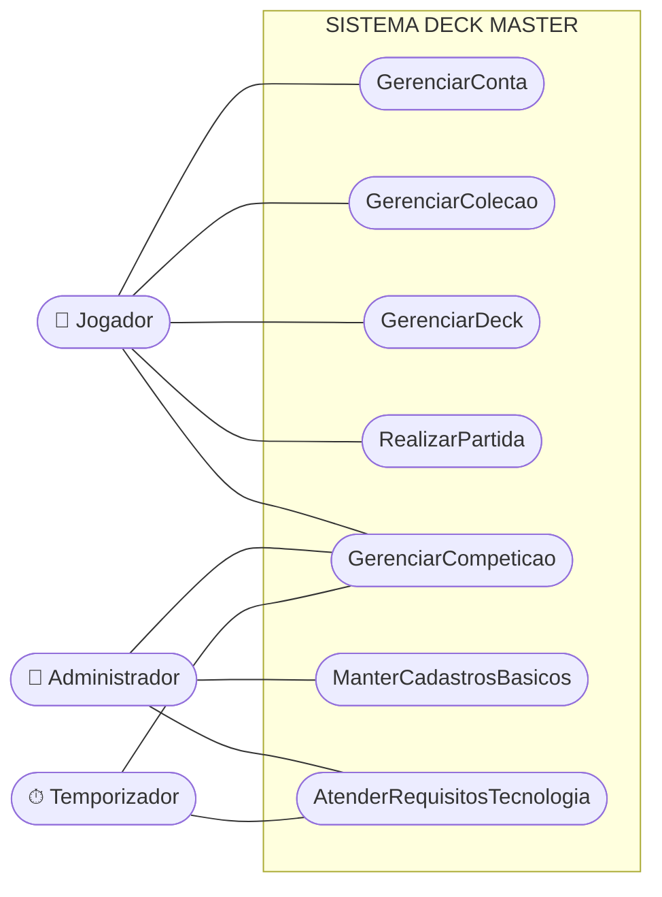

> Os subsistemas **S6** e **S7** são os que surgiram em tempo de projeto. Os demais vêm do
> Diagrama de Casos de Uso Principal de Análise (Anexo II).

### 2.2 Subsistema AtenderRequisitosTecnologia (decomposição)

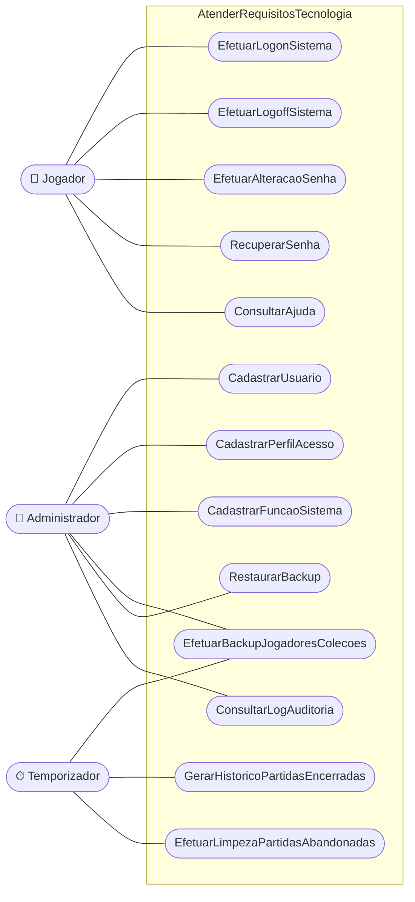

### 2.3 Subsistema ManterCadastrosBasicos (decomposição)

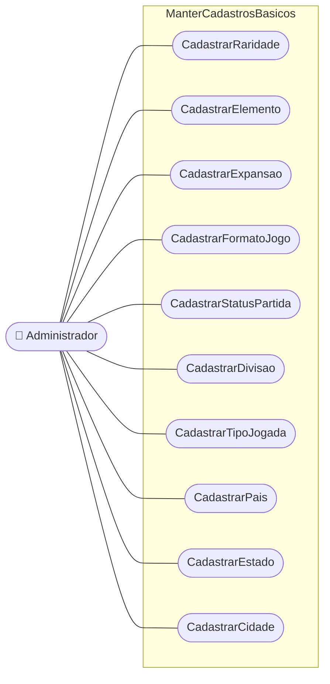

---

## 3 — DESCRIÇÃO DE CASOS DE USO DE PROJETO

Descrição dos casos de uso tecnológicos de nível mínimo, no padrão UML utilizado no trabalho de
Análise OO.

### CDU-T01 — EfetuarLogonSistema

| Campo | Conteúdo |
|---|---|
| **Ator principal** | Jogador / Administrador |
| **Objetivo** | Identificar, autenticar e autorizar o usuário, liberando o acesso às funções compatíveis com o seu perfil. |
| **Pré-condições** | O usuário possui conta cadastrada e ativa no sistema. |
| **Pós-condições** | Sessão criada, perfil de acesso carregado e data do último acesso atualizada. |

**Fluxo principal**
1. O usuário solicita o acesso ao sistema.
2. O sistema apresenta a tela de logon solicitando login e senha.
3. O usuário informa login e senha e confirma.
4. O sistema localiza o usuário pelo login.
5. O sistema calcula o resumo criptográfico da senha informada e o compara com o armazenado.
6. O sistema verifica se o usuário está ativo.
7. O sistema carrega o perfil de acesso e as funções autorizadas.
8. O sistema registra a data e a hora do acesso e abre a tela principal.

**Fluxos alternativos**
- **A1 – Senha expirada:** no passo 6, se a senha estiver expirada, o sistema desvia para o caso
  de uso *EfetuarAlteracaoSenha* e retorna ao passo 7.

**Exceções**
- **E1 – Login inexistente:** o sistema informa "usuário ou senha inválidos" e retorna ao passo 2.
- **E2 – Senha inválida:** o sistema incrementa o contador de tentativas, informa "usuário ou
  senha inválidos" e retorna ao passo 2. Após 5 tentativas consecutivas, a conta é bloqueada.
- **E3 – Usuário inativo/bloqueado:** o sistema informa a situação e encerra o caso de uso.

### CDU-T02 — EfetuarAlteracaoSenha

| Campo | Conteúdo |
|---|---|
| **Ator principal** | Jogador / Administrador |
| **Objetivo** | Permitir a troca da senha de acesso. |
| **Pré-condições** | Usuário autenticado, ou em fluxo de senha expirada. |
| **Pós-condições** | Nova senha armazenada de forma cifrada e data de expiração recalculada. |

**Fluxo principal**
1. O usuário solicita a alteração de senha.
2. O sistema solicita a senha atual, a nova senha e a confirmação da nova senha.
3. O usuário informa os dados e confirma.
4. O sistema valida a senha atual.
5. O sistema valida a nova senha quanto à política de senhas (mínimo de 8 caracteres, ao menos
   uma letra e um número, diferente das 3 últimas utilizadas).
6. O sistema grava o novo resumo criptográfico e confirma a operação.

**Exceções**
- **E1 – Senha atual incorreta:** informa o erro e retorna ao passo 2.
- **E2 – Nova senha fora da política ou divergente da confirmação:** informa o erro e retorna ao
  passo 2.

### CDU-T03 — CadastrarPerfilAcesso

| Campo | Conteúdo |
|---|---|
| **Ator principal** | Administrador |
| **Objetivo** | Manter os perfis de acesso e as funções do sistema autorizadas a cada perfil. |
| **Pré-condições** | Administrador autenticado com permissão de administração de segurança. |
| **Pós-condições** | Perfil de acesso incluído, alterado ou excluído. |

**Fluxo principal**
1. O administrador solicita a manutenção de perfis de acesso.
2. O sistema apresenta a relação de perfis já cadastrados.
3. O administrador seleciona incluir, alterar ou excluir.
4. No caso de inclusão/alteração, o sistema solicita o nome e a descrição do perfil e apresenta a
   lista de funções do sistema.
5. O administrador marca as funções autorizadas e confirma.
6. O sistema valida a unicidade do nome e grava o perfil e suas funções.

**Exceções**
- **E1 – Nome de perfil já existente:** informa o erro e retorna ao passo 4.
- **E2 – Exclusão de perfil em uso:** o sistema impede a exclusão e informa a quantidade de
  usuários vinculados.

### CDU-T04 — EfetuarBackupJogadoresColecoes

| Campo | Conteúdo |
|---|---|
| **Ator principal** | Temporizador (execução automática) / Administrador (execução manual) |
| **Objetivo** | Copiar para meio secundário os dados de jogadores, coleções, decks e pontuações, garantindo a recuperação em caso de falha. |
| **Pré-condições** | Existir área de destino configurada e disponível. |
| **Pós-condições** | Arquivo de backup gerado, verificado e registrado no log de operações. |

**Fluxo principal**
1. O temporizador dispara a rotina diariamente às 04:00, ou o administrador a solicita.
2. O sistema bloqueia temporariamente as gravações nas tabelas envolvidas.
3. O sistema exporta os dados de jogadores, usuários, coleções, decks, pontuações e temporadas.
4. O sistema compacta e cifra o arquivo gerado.
5. O sistema calcula e armazena o resumo de verificação (hash) do arquivo.
6. O sistema transfere o arquivo para o armazenamento de objetos na nuvem.
7. O sistema libera as gravações e registra o resultado no log.

**Exceções**
- **E1 – Falha de espaço ou de transferência:** o sistema aborta, libera as gravações, registra a
  falha e notifica o administrador por e-mail.

### CDU-T05 — GerarHistoricoPartidasEncerradas

| Campo | Conteúdo |
|---|---|
| **Ator principal** | Temporizador |
| **Objetivo** | Transferir para a base histórica as partidas encerradas há mais de 90 dias, mantendo o desempenho da base operacional e preservando os dados para consulta e estatística. |
| **Pré-condições** | Existir base histórica disponível. |
| **Pós-condições** | Partidas, turnos e jogadas antigas movidos para a base histórica e removidos da base operacional. |

**Fluxo principal**
1. O temporizador dispara a rotina no primeiro dia de cada mês.
2. O sistema seleciona as partidas com situação "Encerrada" e data de fim anterior a 90 dias.
3. O sistema copia as partidas e suas participações, turnos e jogadas para a base histórica.
4. O sistema confere a quantidade de registros copiados.
5. O sistema exclui os registros da base operacional e registra o total no log.

**Exceções**
- **E1 – Divergência na conferência:** o sistema desfaz a transação, não exclui nada da base
  operacional e notifica o administrador.

### CDU-T06 — EfetuarLimpezaPartidasAbandonadas

| Campo | Conteúdo |
|---|---|
| **Ator principal** | Temporizador |
| **Objetivo** | Encerrar automaticamente as partidas que ficaram paradas além do tempo limite, liberando os jogadores e mantendo a base consistente. |
| **Pré-condições** | — |
| **Pós-condições** | Partidas com situação "Em Andamento" ou "Pausada" há mais de 30 minutos sem jogadas passam para "Encerrada", com derrota por ausência para o jogador inativo. |

**Fluxo principal**
1. O temporizador dispara a rotina a cada 5 minutos.
2. O sistema seleciona as partidas sem jogadas há mais de 30 minutos.
3. Para cada partida, o sistema identifica o jogador inativo e o declara perdedor por ausência.
4. O sistema altera a situação da partida para "Encerrada".
5. Se a partida for ranqueada, o sistema aciona *AtualizarPontuacaoTemporada*.
6. O sistema registra a operação no log.

---

## 4 — PROJETO DE ARQUITETURA DO SISTEMA

### 4.1 Estilos arquiteturais adotados

| Nível | Estilo | Justificativa |
|---|---|---|
| Arquitetura de sistema | **Cliente-servidor em 3 camadas físicas** | O jogo é competitivo e online: as regras precisam ser aplicadas em um ponto confiável, fora do alcance do jogador, o que inviabiliza uma arquitetura puramente local. |
| Arquitetura de software (macro) | **Camadas (layered) — MVC-P** | Exigido pela disciplina e adequado à separação entre apresentação, controle, domínio e persistência, favorecendo a manutenção e o teste isolado das regras. |
| Arquitetura de software (comunicação) | **Cliente-servidor com serviços REST + WebSocket** | REST atende às operações de cadastro, coleção e deck; WebSocket atende à partida, que exige comunicação bidirecional e de baixa latência entre os dois jogadores. |
| Persistência | **Repositório (DAO) sobre SGBD relacional** | Isola o domínio da tecnologia de banco, permitindo trocar o SGBD sem alterar o modelo. |
| Regras de partida | **Máquina de estados** | A partida percorre estados bem definidos (Aguardando, Em Andamento, Pausada, Encerrada, Cancelada), como registrado no Anexo V. |

### 4.2 Desenho da arquitetura do sistema

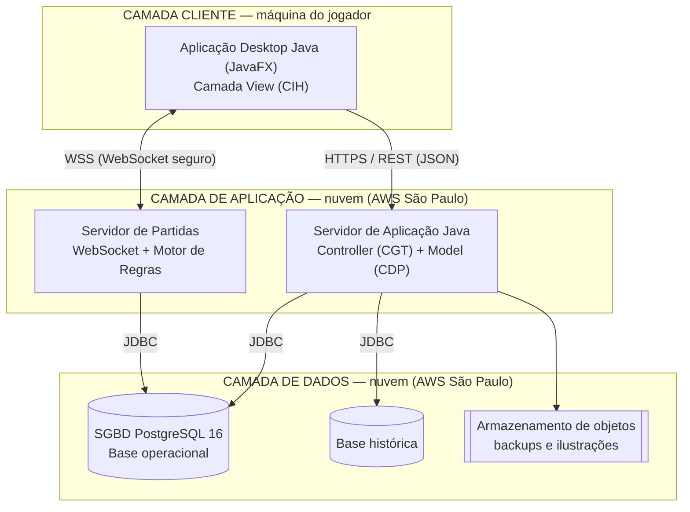

### 4.3 Decisões arquiteturais registradas

| Item exigido | Decisão |
|---|---|
| Distribuição geográfica dos requisitos computacionais | Processamento das regras e dos dados centralizado na região AWS `sa-east-1` (São Paulo). Apenas a apresentação é distribuída, executando na máquina de cada jogador. |
| Componentes de hardware — máquinas clientes | Processador dual-core 2.0 GHz, 4 GB de RAM, 2 GB de disco livre, placa de vídeo com suporte a OpenGL 2.0, resolução mínima 1366×768 e conexão de 5 Mbps. |
| Componentes de hardware — máquinas servidoras | 2 instâncias de aplicação (4 vCPU, 8 GB RAM, 50 GB SSD) atrás de balanceador de carga; 1 instância de banco (4 vCPU, 16 GB RAM, 200 GB SSD com IOPS provisionado) com réplica de leitura. |
| Configuração e número de camadas cliente-servidor | Três camadas físicas: cliente de apresentação, servidor de aplicação e servidor de banco de dados. |
| Plataforma de software de implementação | Linguagem **Java 21**; interface com o usuário em **JavaFX 21**; serviços em **Spring Boot 3**; comunicação em **HTTPS/REST (JSON)** e **WebSocket (WSS)**; sistema operacional dos servidores **Ubuntu Server 24.04 LTS**; clientes em **Windows 10/11, macOS 13+ e Ubuntu 22.04+**; SGBD **PostgreSQL 16**; acesso a dados via **JDBC**. |
| Localização dos processos | Regras de negócio, validação de decks, sorteio de cartas e apuração de ranking executam exclusivamente no servidor. O cliente executa apenas renderização, captura de comandos e validações de preenchimento de formulário. |
| Localização dos dados físicos | Base única centralizada no servidor de banco na nuvem. O cliente mantém apenas cache local temporário de imagens de cartas e das preferências de interface. |
| Estratégias de sincronização de dados distribuídos | Não há dados de negócio distribuídos geograficamente, o que elimina a necessidade de sincronização entre bases. A réplica de leitura é sincronizada por replicação nativa em modo streaming assíncrono e é usada apenas para consultas de ranking e histórico. |
| Computação em nuvem ou servidores locais | **Computação em nuvem** (AWS), pela elasticidade necessária ao pico de jogadores simultâneos e por dispensar investimento inicial em infraestrutura. |
| Desenvolvimento local ou em nuvem | **Desenvolvimento em máquinas locais** com IntelliJ IDEA, banco PostgreSQL em contêiner Docker e versionamento em repositório Git remoto; a integração e a implantação são automatizadas na nuvem. |

---

## 5 — PROJETO DE ARQUITETURA DO SOFTWARE: DIAGRAMA DE PACOTES

A organização adotada combina as duas alternativas propostas por Magela (1998): a divisão de
primeiro nível segue os **estereótipos** do MVC-P (view, controller, model, persistence) e, dentro
de `model`, `controller` e `persistence`, a divisão de segundo nível segue o **domínio do problema**
(conta, carta, colecao, deck, partida, competicao, seguranca).

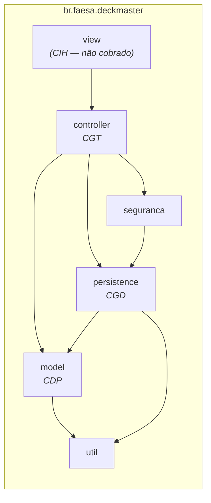

**Decomposição de segundo nível**

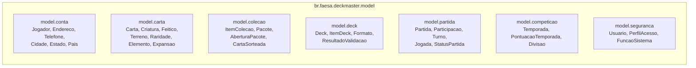

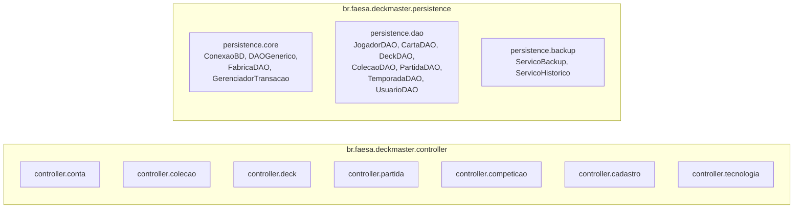

---

## 6 — PROJETO DE INTERFACE COM USUÁRIO

A interface do Deck Master segue o **padrão Windows (aplicação desktop)**, implementada em JavaFX.
Foi escolhida em lugar do padrão Web porque a partida exige renderização fluida das cartas, arrastar
e soltar, animações e latência baixa e previsível.

### 6.1 Mapa de navegação — perfil Jogador

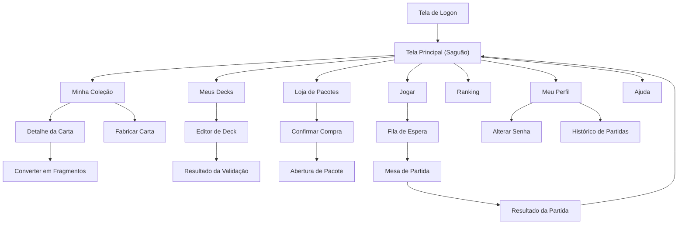

### 6.2 Mapa de navegação — perfil Administrador

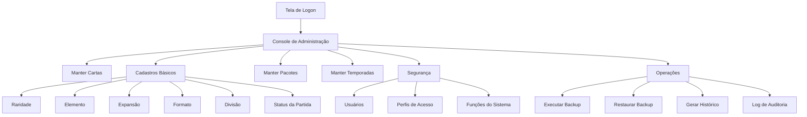

### 6.3 Projeto da interface humana (protótipo)

> **PENDÊNCIA:** capturar as telas do protótipo e colar aqui, com o passo-a-passo da execução.
> Os esboços abaixo indicam o que cada tela deve conter.

**Tela de Logon**
```
+--------------------------------------------------+
|                   DECK MASTER                    |
|                                                  |
|   Login  [__________________________]            |
|   Senha  [__________________________]            |
|                                                  |
|   [ Entrar ]   [ Criar conta ]  [ Esqueci senha ]|
|                                                  |
|   status: ____________________________________   |
+--------------------------------------------------+
```

**Tela Principal (Saguão)**
```
+--------------------------------------------------------------+
| DECK MASTER        Apelido | Cristais: 1200 | Fragmentos: 340 |
+--------------------------------------------------------------+
| [ JOGAR ]                                                     |
|                                                               |
| [ Minha Coleção ] [ Meus Decks ] [ Loja ] [ Ranking ]         |
| [ Meu Perfil ]    [ Ajuda ]      [ Sair ]                     |
+--------------------------------------------------------------+
| Temporada 3 - Divisão OURO - 1450 pts - 42º lugar             |
+--------------------------------------------------------------+
```

**Editor de Deck**
```
+---------------------------+----------------------------------+
| COLEÇÃO (filtros)         | DECK: "Fúria Élfica"             |
| [busca______] [elem v]    | Formato: Padrão                  |
| [raridade v] [custo v]    | Cartas: 58/60   Máx cópias: 3    |
+---------------------------+----------------------------------+
| . Dragão Rubro    (3x)    | 3x Dragão Rubro                  |
| . Bola de Fogo    (2x)    | 2x Bola de Fogo                  |
| . Montanha        (9x)    | 9x Montanha                      |
|                           |                                  |
| [ >> Adicionar ]          | [ << Remover ]                   |
+---------------------------+----------------------------------+
| [ Validar ]  [ Salvar ]  [ Cancelar ]                        |
| aviso: faltam 2 cartas para o mínimo do formato              |
+--------------------------------------------------------------+
```

**Mesa de Partida**
```
+--------------------------------------------------------------+
| OPONENTE  Vida: 18  Mão: 4  Deck: 31          Turno 7        |
|   [carta][carta][carta]                    <- campo oponente |
+--------------------------------------------------------------+
|                       CAMPO DE BATALHA                        |
+--------------------------------------------------------------+
|   [carta][carta]                              <- seu campo   |
| VOCÊ  Vida: 22  Recursos: 5/7                 [Passar turno] |
|   MÃO: [c1][c2][c3][c4][c5]                   [Render-se]    |
+--------------------------------------------------------------+
```

---

## 7 — PROJETO DOS COMPONENTES ORIENTADOS A OBJETOS

### 7.1 Componente de Domínio do Problema (CDP) — camada Model

#### 7.1.1 Decisões de projeto documentadas

**a) Tradução da navegabilidade dos relacionamentos**

| Relacionamento | Navegabilidade projetada | Justificativa |
|---|---|---|
| Jogador — Deck | Bidirecional | O deck precisa saber a quem pertence para a validação de posse das cartas, e o jogador precisa listar seus decks. |
| Jogador — ItemColecao — Carta | Jogador → ItemColecao → Carta (unidirecional) | A carta é um dado de catálogo, compartilhado por todos; não deve conhecer quem a possui. |
| Deck — ItemDeck — Carta | Deck → ItemDeck → Carta (unidirecional) | Mesma razão do item anterior. |
| Partida — Participacao — Jogador | Partida → Participacao → Jogador (unidirecional) | Evita que o jogador carregue todo o seu histórico de partidas ao ser lido da base. |
| Partida — Turno — Jogada | Bidirecional entre Turno e Partida; Turno → Jogada unidirecional | O motor de regras precisa subir do turno para a partida ao aplicar efeitos. |
| Carta — Raridade / Expansao / Elemento | Carta → classes de apoio (unidirecional) | Classes de apoio não precisam conhecer as cartas que as referenciam. |
| Temporada — PontuacaoTemporada — Jogador | Bidirecional entre Temporada e PontuacaoTemporada | A apuração do ranking percorre todas as pontuações da temporada. |

**b) e c) Visibilidade, tipos de dados e assinaturas completas** — ver o diagrama de classes em
7.1.2. Todos os atributos são **privados**, com acesso por métodos públicos; os atributos das
superclasses acessados pelas subclasses são **protegidos**.

**d) Novos atributos para acelerar procedimentos (totalizadores e acumuladores)**

| Classe | Atributo | Finalidade |
|---|---|---|
| `Jogador` | `totalPartidas`, `totalVitorias` | Evita contar as participações a cada exibição do perfil. |
| `Jogador` | `saldoCristais`, `saldoFragmentos` | Saldo acumulado, evitando somar todo o extrato de transações. |
| `Deck` | `quantidadeTotalCartas` | Evita percorrer os itens do deck a cada validação e a cada exibição da lista. |
| `Partida` | `numeroTurnos` | Evita contar os turnos ao montar o histórico. |
| `Expansao` | `totalCartas` | Evita contar as cartas da expansão na tela da loja. |
| `PontuacaoTemporada` | `vitorias`, `derrotas` | Acumuladores usados no ranking. |

**e) Novos atributos para atender ao Diagrama de Estados**

| Classe | Atributo | Observação |
|---|---|---|
| `Partida` | `status: StatusPartida` | Materializa o estado corrente do Diagrama de Estados do Anexo V. |
| `Partida` | `dataHoraUltimaJogada: LocalDateTime` | Necessário para as transições por tempo esgotado. |
| `Partida` | `motivoEncerramento: String` | Distingue vitória por pontos de vida, rendição, tempo e ausência. |
| `Usuario` | `ativo: boolean`, `tentativasFalhas: int` | Suportam os estados de conta bloqueada. |

**f) Herança múltipla** — não há herança múltipla no modelo. A única hierarquia é
`Carta → {Criatura, Feitico, Terreno}`, que é simples e disjunta. Como Java não suporta herança
múltipla de classes, o modelo já foi construído nessa restrição.

**g) Reutilização de classes existentes** — `Endereco`, `Telefone`, `Cidade`, `Estado` e `Pais` são
reaproveitadas do componente corporativo de cadastro do estúdio; `DAOGenerico<T>` e `ConexaoBD` são
reaproveitados do framework interno de persistência.

**h) Resolução de itens de grupo** — o atributo `endereco` de `Jogador`, que na análise era um item
de grupo (logradouro, número, complemento, bairro, CEP, cidade, estado, país), foi transformado na
classe `Endereco`, ligada a `Jogador` por um relacionamento 1:1, com `Cidade`, `Estado` e `Pais`
como classes próprias.

**i) Resolução de atributos multivalorados** — o atributo `telefone*` de `Jogador` foi transformado
na classe `Telefone` (1:N a partir de `Jogador`), com `tipo` e `numero`.

**j) Novas classes criadas para atender a requisitos de interface**

| Classe | Finalidade |
|---|---|
| `ResultadoValidacao` | Transporta para a tela do editor de deck a lista de erros e avisos da validação, em vez de lançar exceções uma a uma. |
| `LinhaRanking` | Objeto de transferência com apelido, divisão, pontos e posição, montado por consulta única para a tela de ranking. |
| `ResumoPartida` | Objeto de transferência para a tela de histórico, evitando carregar turnos e jogadas. |
| `FiltroColecao` | Agrupa os critérios de busca da tela de coleção (texto, elemento, raridade, custo e expansão). |

**k) Resolução das classes de associação** — as três classes de associação da análise foram
traduzidas em classes próprias, cada uma com dois relacionamentos 1:N:

| Classe de associação (análise) | Tradução (projeto) |
|---|---|
| `Colecao` (Jogador N:N Carta, com quantidade) | `ItemColecao`: `Jogador 1:N ItemColecao` e `Carta 1:N ItemColecao` |
| `ComposicaoDeck` (Deck N:N Carta, com quantidade) | `ItemDeck`: `Deck 1:N ItemDeck` e `Carta 1:N ItemDeck` |
| `Participacao` (Jogador N:N Partida, com deck e resultado) | `Participacao`: `Partida 1:N Participacao` e `Jogador 1:N Participacao` |
| `Pontuacao` (Jogador N:N Temporada, com pontos) | `PontuacaoTemporada`: `Temporada 1:N PontuacaoTemporada` e `Jogador 1:N PontuacaoTemporada` |
| `Carta N:N Elemento` (sem atributos) | `CartaElemento`, criada apenas no projeto de dados (seção 8) |

#### 7.1.2 Diagrama de Classes do CDP

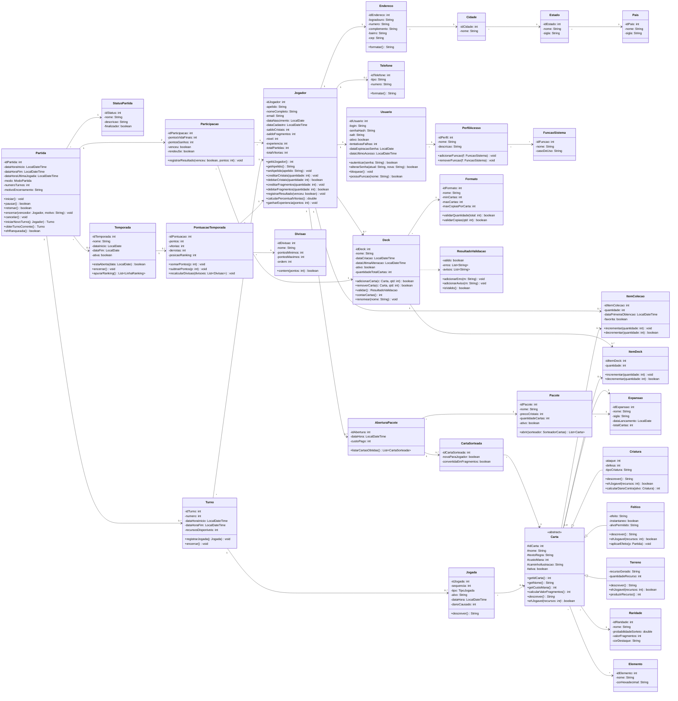

### 7.2 Componente de Gerência de Tarefa (CGT) — camada Controller

Uma classe controladora por caso de uso de nível mínimo, mais quatro classes de apoio que
coordenam comportamento compartilhado entre casos de uso.

```mermaid
classDiagram
  direction TB

  class CtrlCadastrarJogador {
    -jogadorDAO: JogadorDAO
    -usuarioDAO: UsuarioDAO
    +cadastrar(dados: Jogador, login: String, senha: String) Jogador
    +validarApelidoDisponivel(apelido: String) boolean
    +validarEmailDisponivel(email: String) boolean
    +concederConteudoInicial(j: Jogador) void
  }

  class CtrlEfetuarLogon {
    -usuarioDAO: UsuarioDAO
    -gerenciadorSessao: GerenciadorSessao
    +efetuarLogon(login: String, senha: String) Sessao
    +efetuarLogoff(s: Sessao) void
    +alterarSenha(s: Sessao, atual: String, nova: String) boolean
  }

  class CtrlManterColecao {
    -colecaoDAO: ColecaoDAO
    -cartaDAO: CartaDAO
    +consultar(j: Jogador, f: FiltroColecao) List~ItemColecao~
    +converterEmFragmentos(j: Jogador, c: Carta, qtd: int) int
    +fabricarCarta(j: Jogador, c: Carta) boolean
  }

  class CtrlComprarAbrirPacote {
    -pacoteDAO: PacoteDAO
    -colecaoDAO: ColecaoDAO
    -sorteador: SorteadorCartas
    +comprar(j: Jogador, p: Pacote, qtd: int) boolean
    +abrir(j: Jogador, p: Pacote) AberturaPacote
  }

  class CtrlManterDeck {
    -deckDAO: DeckDAO
    -colecaoDAO: ColecaoDAO
    +criar(j: Jogador, nome: String, f: Formato) Deck
    +adicionarCarta(d: Deck, c: Carta, qtd: int) ResultadoValidacao
    +removerCarta(d: Deck, c: Carta, qtd: int) ResultadoValidacao
    +validar(d: Deck) ResultadoValidacao
    +salvar(d: Deck) boolean
    +excluir(d: Deck) boolean
  }

  class CtrlRealizarPartida {
    -partidaDAO: PartidaDAO
    -fila: GerenciadorFilaPartidas
    -motor: MotorRegrasPartida
    +solicitarPartida(j: Jogador, d: Deck, modo: ModoPartida) Partida
    +realizarJogada(p: Partida, j: Jogador, jogada: Jogada) boolean
    +passarTurno(p: Partida, j: Jogador) Turno
    +renderSe(p: Partida, j: Jogador) void
    +encerrar(p: Partida) void
    +consultarHistorico(j: Jogador) List~ResumoPartida~
  }

  class CtrlGerenciarCompeticao {
    -temporadaDAO: TemporadaDAO
    +cadastrarTemporada(t: Temporada) Temporada
    +atualizarPontuacao(p: Partida) void
    +consultarRanking(t: Temporada, pagina: int) List~LinhaRanking~
    +encerrarTemporada(t: Temporada) void
  }

  class CtrlManterCadastrosBasicos {
    -fabricaDAO: FabricaDAO
    +incluir(entidade: Object) boolean
    +alterar(entidade: Object) boolean
    +excluir(entidade: Object) boolean
    +listar(tipo: Class) List~Object~
  }

  class CtrlAtenderRequisitosTecnologia {
    -servicoBackup: ServicoBackup
    -servicoHistorico: ServicoHistorico
    +efetuarBackup() boolean
    +restaurarBackup(arquivo: String) boolean
    +gerarHistoricoPartidas(diasCorte: int) int
    +limparPartidasAbandonadas(minutos: int) int
    +consultarLogAuditoria(inicio: LocalDate, fim: LocalDate) List~String~
  }

  class GerenciadorSessao {
    -sessoesAtivas: Map~String, Sessao~
    +abrir(u: Usuario) Sessao
    +fechar(token: String) void
    +validar(token: String) boolean
    +autorizar(token: String, funcao: String) boolean
  }

  class GerenciadorFilaPartidas {
    -fila: Queue~Jogador~
    +entrar(j: Jogador, d: Deck, modo: ModoPartida) void
    +sair(j: Jogador) void
    +buscarOponente(j: Jogador) Jogador
  }

  class MotorRegrasPartida {
    +validarJogada(p: Partida, j: Jogada) boolean
    +aplicarJogada(p: Partida, j: Jogada) void
    +calcularCombate(atacante: Criatura, defensor: Criatura) int
    +verificarFimDePartida(p: Partida) boolean
  }

  class SorteadorCartas {
    -raridades: List~Raridade~
    +sortear(p: Pacote) List~Carta~
    +sortearPorRaridade(r: Raridade, e: Expansao) Carta
  }

  CtrlRealizarPartida --> GerenciadorFilaPartidas
  CtrlRealizarPartida --> MotorRegrasPartida
  CtrlComprarAbrirPacote --> SorteadorCartas
  CtrlEfetuarLogon --> GerenciadorSessao
```

### 7.3 Componente de Gerência de Dados (CGD) — camada Persistent

```mermaid
classDiagram
  direction TB

  class ConexaoBD {
    -instancia: ConexaoBD$
    -pool: DataSource
    -ConexaoBD()
    +obterInstancia() ConexaoBD$
    +obterConexao() Connection
    +liberarConexao(c: Connection) void
    +encerrarPool() void
  }

  class IDAO~T~ {
    <<interface>>
    +inserir(objeto: T) int
    +alterar(objeto: T) boolean
    +excluir(id: int) boolean
    +buscarPorId(id: int) T
    +listarTodos() List~T~
  }

  class DAOGenerico~T~ {
    <<abstract>>
    #conexao: ConexaoBD
    #nomeTabela: String
    #montarObjeto(rs: ResultSet)* T
    #montarParametros(ps: PreparedStatement, o: T)* void
    +inserir(objeto: T) int
    +alterar(objeto: T) boolean
    +excluir(id: int) boolean
    +buscarPorId(id: int) T
    +listarTodos() List~T~
  }

  class FabricaDAO {
    +criarJogadorDAO() JogadorDAO$
    +criarCartaDAO() CartaDAO$
    +criarDeckDAO() DeckDAO$
    +criarColecaoDAO() ColecaoDAO$
    +criarPartidaDAO() PartidaDAO$
    +criarTemporadaDAO() TemporadaDAO$
    +criarUsuarioDAO() UsuarioDAO$
  }

  class GerenciadorTransacao {
    -conexao: Connection
    +iniciar() void
    +confirmar() void
    +desfazer() void
  }

  class JogadorDAO {
    +montarObjeto(rs: ResultSet) Jogador
    +buscarPorApelido(apelido: String) Jogador
    +buscarPorEmail(email: String) Jogador
    +atualizarSaldos(j: Jogador) boolean
    +atualizarTotalizadores(j: Jogador) boolean
  }

  class UsuarioDAO {
    +montarObjeto(rs: ResultSet) Usuario
    +buscarPorLogin(login: String) Usuario
    +registrarAcesso(u: Usuario) boolean
    +incrementarTentativasFalhas(u: Usuario) boolean
  }

  class CartaDAO {
    +montarObjeto(rs: ResultSet) Carta
    +listarPorExpansao(e: Expansao) List~Carta~
    +listarPorRaridade(r: Raridade) List~Carta~
    +listarPorFiltro(f: FiltroColecao) List~Carta~
  }

  class ColecaoDAO {
    +montarObjeto(rs: ResultSet) ItemColecao
    +listarPorJogador(j: Jogador, f: FiltroColecao) List~ItemColecao~
    +buscarItem(j: Jogador, c: Carta) ItemColecao
    +creditarCarta(j: Jogador, c: Carta, qtd: int) boolean
    +debitarCarta(j: Jogador, c: Carta, qtd: int) boolean
  }

  class DeckDAO {
    +montarObjeto(rs: ResultSet) Deck
    +listarPorJogador(j: Jogador) List~Deck~
    +carregarItens(d: Deck) List~ItemDeck~
    +salvarItens(d: Deck) boolean
  }

  class PartidaDAO {
    +montarObjeto(rs: ResultSet) Partida
    +listarPorJogador(j: Jogador, limite: int) List~ResumoPartida~
    +salvarTurno(t: Turno) int
    +salvarJogada(j: Jogada) int
    +listarAbandonadas(minutos: int) List~Partida~
  }

  class TemporadaDAO {
    +montarObjeto(rs: ResultSet) Temporada
    +buscarAtiva() Temporada
    +buscarPontuacao(t: Temporada, j: Jogador) PontuacaoTemporada
    +salvarPontuacao(p: PontuacaoTemporada) boolean
    +apurarRanking(t: Temporada, pagina: int) List~LinhaRanking~
  }

  class ServicoBackup {
    -destino: String
    +executar() boolean
    +restaurar(arquivo: String) boolean
    +verificarIntegridade(arquivo: String) boolean
  }

  class ServicoHistorico {
    +moverPartidasEncerradas(diasCorte: int) int
    +consultarHistorico(j: Jogador) List~ResumoPartida~
  }

  IDAO <|.. DAOGenerico
  DAOGenerico <|-- JogadorDAO
  DAOGenerico <|-- UsuarioDAO
  DAOGenerico <|-- CartaDAO
  DAOGenerico <|-- ColecaoDAO
  DAOGenerico <|-- DeckDAO
  DAOGenerico <|-- PartidaDAO
  DAOGenerico <|-- TemporadaDAO
  DAOGenerico --> ConexaoBD
  FabricaDAO ..> JogadorDAO
  FabricaDAO ..> CartaDAO
  FabricaDAO ..> DeckDAO
  GerenciadorTransacao --> ConexaoBD
  ServicoBackup --> ConexaoBD
  ServicoHistorico --> PartidaDAO
```

---

## 8 — PROJETO DE DADOS

### 8.1 Estratégias de tradução adotadas (Scott Ambler)

| Situação | Solução adotada |
|---|---|
| Identidade dos objetos | Toda tabela recebe uma chave primária artificial (IDO), do tipo `SERIAL`, sem significado de negócio. |
| Relacionamento 1:1 (`Jogador`–`Endereco`, `Jogador`–`Usuario`) | Chave estrangeira no lado dependente, com restrição `UNIQUE`. |
| Relacionamento 1:N (`Jogador`–`Deck`, `Partida`–`Turno`) | Chave estrangeira na tabela do lado N. |
| Relacionamento N:N com atributos (classes de associação) | Tabela própria com chave primária artificial, duas chaves estrangeiras e os atributos da associação, mais restrição `UNIQUE` no par de chaves. |
| Relacionamento N:N sem atributos (`Carta`–`Elemento`) | Tabela associativa `carta_elemento` com chave primária composta pelas duas chaves estrangeiras. |
| Generalização/especialização (`Carta`) | **Uma tabela para a superclasse e uma tabela para cada subclasse** (*map classes to tables*). A tabela `carta` guarda os atributos comuns e um discriminador `tipo_carta`; `criatura`, `feitico` e `terreno` guardam os atributos próprios e têm como chave primária a mesma chave de `carta`. Escolhida por não gerar colunas nulas e manter a integridade referencial única para qualquer carta. |
| Atributo multivalorado (`telefone*`) | Tabela `telefone` com chave estrangeira para `jogador`. |
| Enumerações do domínio (raridade, elemento, formato, divisão, status) | Tabelas de cadastro próprias, permitindo manutenção pelo administrador sem alteração de código. |

### 8.2 Diagrama Relacional

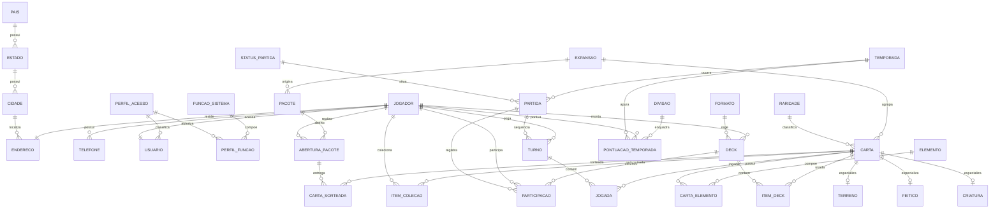

### 8.3 Dicionário das tabelas (tipos de dados)

| Tabela | Colunas |
|---|---|
| `pais` | `id_pais SERIAL PK`, `nome VARCHAR(60) NOT NULL`, `sigla CHAR(2) NOT NULL UNIQUE` |
| `estado` | `id_estado SERIAL PK`, `nome VARCHAR(60) NOT NULL`, `sigla CHAR(2) NOT NULL`, `id_pais INT FK` |
| `cidade` | `id_cidade SERIAL PK`, `nome VARCHAR(80) NOT NULL`, `id_estado INT FK` |
| `endereco` | `id_endereco SERIAL PK`, `logradouro VARCHAR(120)`, `numero VARCHAR(10)`, `complemento VARCHAR(40)`, `bairro VARCHAR(60)`, `cep CHAR(9)`, `id_cidade INT FK` |
| `jogador` | `id_jogador SERIAL PK`, `apelido VARCHAR(20) NOT NULL UNIQUE`, `nome_completo VARCHAR(120) NOT NULL`, `email VARCHAR(120) NOT NULL UNIQUE`, `data_nascimento DATE NOT NULL`, `data_cadastro TIMESTAMP NOT NULL`, `saldo_cristais INT NOT NULL DEFAULT 0`, `saldo_fragmentos INT NOT NULL DEFAULT 0`, `nivel INT NOT NULL DEFAULT 1`, `experiencia INT NOT NULL DEFAULT 0`, `total_partidas INT NOT NULL DEFAULT 0`, `total_vitorias INT NOT NULL DEFAULT 0`, `id_endereco INT FK UNIQUE` |
| `telefone` | `id_telefone SERIAL PK`, `tipo VARCHAR(15)`, `numero VARCHAR(20) NOT NULL`, `id_jogador INT FK` |
| `perfil_acesso` | `id_perfil SERIAL PK`, `nome VARCHAR(40) NOT NULL UNIQUE`, `descricao VARCHAR(160)` |
| `funcao_sistema` | `id_funcao SERIAL PK`, `nome VARCHAR(60) NOT NULL UNIQUE`, `caso_de_uso VARCHAR(60)` |
| `perfil_funcao` | `id_perfil INT FK`, `id_funcao INT FK`, `PK (id_perfil, id_funcao)` |
| `usuario` | `id_usuario SERIAL PK`, `login VARCHAR(30) NOT NULL UNIQUE`, `senha_hash VARCHAR(128) NOT NULL`, `salt VARCHAR(32) NOT NULL`, `ativo BOOLEAN NOT NULL DEFAULT TRUE`, `tentativas_falhas SMALLINT NOT NULL DEFAULT 0`, `data_expiracao_senha DATE`, `data_ultimo_acesso TIMESTAMP`, `id_jogador INT FK UNIQUE`, `id_perfil INT FK` |
| `raridade` | `id_raridade SERIAL PK`, `nome VARCHAR(20) NOT NULL UNIQUE`, `probabilidade_sorteio NUMERIC(6,4) NOT NULL`, `valor_fragmentos INT NOT NULL`, `cor_destaque CHAR(7)` |
| `elemento` | `id_elemento SERIAL PK`, `nome VARCHAR(20) NOT NULL UNIQUE`, `cor_hexadecimal CHAR(7)` |
| `expansao` | `id_expansao SERIAL PK`, `nome VARCHAR(60) NOT NULL`, `sigla CHAR(3) NOT NULL UNIQUE`, `data_lancamento DATE`, `total_cartas INT NOT NULL DEFAULT 0` |
| `carta` | `id_carta SERIAL PK`, `nome VARCHAR(60) NOT NULL`, `texto_regra VARCHAR(400)`, `custo_mana SMALLINT NOT NULL`, `caminho_ilustracao VARCHAR(200)`, `ativa BOOLEAN NOT NULL DEFAULT TRUE`, `tipo_carta CHAR(1) NOT NULL`, `id_raridade INT FK`, `id_expansao INT FK` |
| `criatura` | `id_carta INT PK FK`, `ataque SMALLINT NOT NULL`, `defesa SMALLINT NOT NULL`, `tipo_criatura VARCHAR(30)` |
| `feitico` | `id_carta INT PK FK`, `efeito VARCHAR(200)`, `instantaneo BOOLEAN NOT NULL`, `alvo_permitido VARCHAR(30)` |
| `terreno` | `id_carta INT PK FK`, `recurso_gerado VARCHAR(20)`, `quantidade_recurso SMALLINT NOT NULL` |
| `carta_elemento` | `id_carta INT FK`, `id_elemento INT FK`, `PK (id_carta, id_elemento)` |
| `item_colecao` | `id_item_colecao SERIAL PK`, `quantidade INT NOT NULL`, `data_primeira_obtencao TIMESTAMP`, `favorita BOOLEAN NOT NULL DEFAULT FALSE`, `id_jogador INT FK`, `id_carta INT FK`, `UNIQUE (id_jogador, id_carta)` |
| `formato` | `id_formato SERIAL PK`, `nome VARCHAR(30) NOT NULL UNIQUE`, `min_cartas SMALLINT NOT NULL`, `max_cartas SMALLINT NOT NULL`, `max_copias_por_carta SMALLINT NOT NULL` |
| `deck` | `id_deck SERIAL PK`, `nome VARCHAR(40) NOT NULL`, `data_criacao TIMESTAMP NOT NULL`, `data_ultima_alteracao TIMESTAMP`, `ativo BOOLEAN NOT NULL DEFAULT TRUE`, `quantidade_total_cartas INT NOT NULL DEFAULT 0`, `id_jogador INT FK`, `id_formato INT FK` |
| `item_deck` | `id_item_deck SERIAL PK`, `quantidade SMALLINT NOT NULL`, `id_deck INT FK`, `id_carta INT FK`, `UNIQUE (id_deck, id_carta)` |
| `pacote` | `id_pacote SERIAL PK`, `nome VARCHAR(40) NOT NULL`, `preco_cristais INT NOT NULL`, `quantidade_cartas SMALLINT NOT NULL`, `ativo BOOLEAN NOT NULL DEFAULT TRUE`, `id_expansao INT FK` |
| `abertura_pacote` | `id_abertura SERIAL PK`, `data_hora TIMESTAMP NOT NULL`, `custo_pago INT NOT NULL`, `id_jogador INT FK`, `id_pacote INT FK` |
| `carta_sorteada` | `id_carta_sorteada SERIAL PK`, `nova_para_jogador BOOLEAN NOT NULL`, `convertida_em_fragmentos BOOLEAN NOT NULL DEFAULT FALSE`, `id_abertura INT FK`, `id_carta INT FK` |
| `status_partida` | `id_status SERIAL PK`, `nome VARCHAR(20) NOT NULL UNIQUE`, `descricao VARCHAR(120)`, `finalizador BOOLEAN NOT NULL DEFAULT FALSE` |
| `temporada` | `id_temporada SERIAL PK`, `nome VARCHAR(40) NOT NULL`, `data_inicio DATE NOT NULL`, `data_fim DATE NOT NULL`, `ativa BOOLEAN NOT NULL DEFAULT FALSE` |
| `partida` | `id_partida SERIAL PK`, `data_hora_inicio TIMESTAMP NOT NULL`, `data_hora_fim TIMESTAMP`, `data_hora_ultima_jogada TIMESTAMP`, `modo VARCHAR(10) NOT NULL`, `numero_turnos INT NOT NULL DEFAULT 0`, `motivo_encerramento VARCHAR(40)`, `id_status INT FK`, `id_temporada INT FK NULL` |
| `participacao` | `id_participacao SERIAL PK`, `pontos_vida_finais SMALLINT`, `pontos_ganhos INT NOT NULL DEFAULT 0`, `venceu BOOLEAN NOT NULL DEFAULT FALSE`, `rendeu_se BOOLEAN NOT NULL DEFAULT FALSE`, `id_partida INT FK`, `id_jogador INT FK`, `id_deck INT FK`, `UNIQUE (id_partida, id_jogador)` |
| `turno` | `id_turno SERIAL PK`, `numero SMALLINT NOT NULL`, `data_hora_inicio TIMESTAMP NOT NULL`, `data_hora_fim TIMESTAMP`, `recursos_disponiveis SMALLINT NOT NULL DEFAULT 0`, `id_partida INT FK`, `id_jogador INT FK` |
| `jogada` | `id_jogada SERIAL PK`, `sequencia SMALLINT NOT NULL`, `tipo VARCHAR(20) NOT NULL`, `alvo VARCHAR(40)`, `data_hora TIMESTAMP NOT NULL`, `dano_causado SMALLINT NOT NULL DEFAULT 0`, `id_turno INT FK`, `id_carta INT FK NULL` |
| `divisao` | `id_divisao SERIAL PK`, `nome VARCHAR(20) NOT NULL UNIQUE`, `pontos_minimos INT NOT NULL`, `pontos_maximos INT NOT NULL`, `ordem SMALLINT NOT NULL` |
| `pontuacao_temporada` | `id_pontuacao SERIAL PK`, `pontos INT NOT NULL DEFAULT 0`, `vitorias INT NOT NULL DEFAULT 0`, `derrotas INT NOT NULL DEFAULT 0`, `posicao_ranking INT`, `id_temporada INT FK`, `id_jogador INT FK`, `id_divisao INT FK`, `UNIQUE (id_temporada, id_jogador)` |

---
# ANEXOS

## ANEXO I — DESCRIÇÃO DO MINI-MUNDO

> Usar o mesmo texto da Proposta (Parte 1, seção "Descrição do Mini-mundo"). Está reproduzido lá
> na íntegra e atende ao mínimo de meia página exigido.

---

## ANEXO II — DIAGRAMA DE CASOS DE USO (ANÁLISE)

### II.1 Diagrama de Casos de Uso Principal de Análise

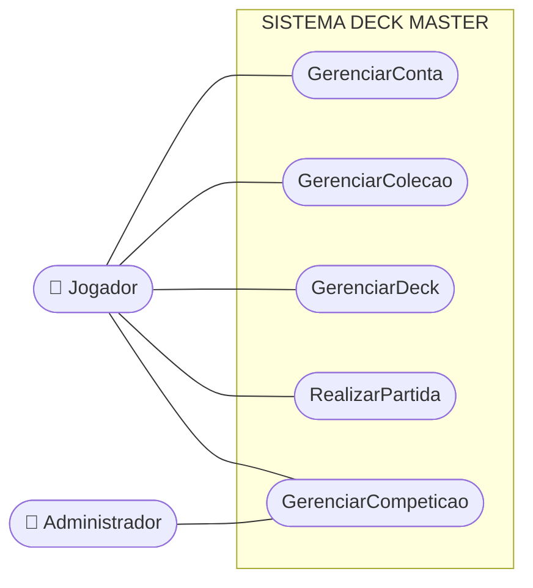

### II.2 Subsistema GerenciarConta

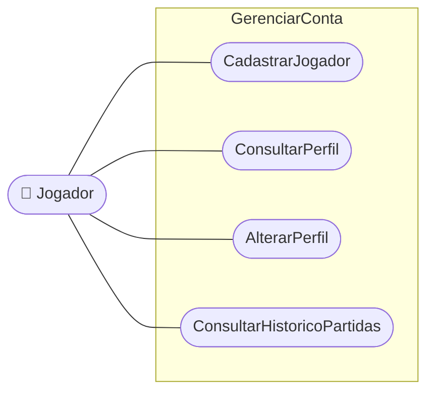

### II.3 Subsistema GerenciarColecao

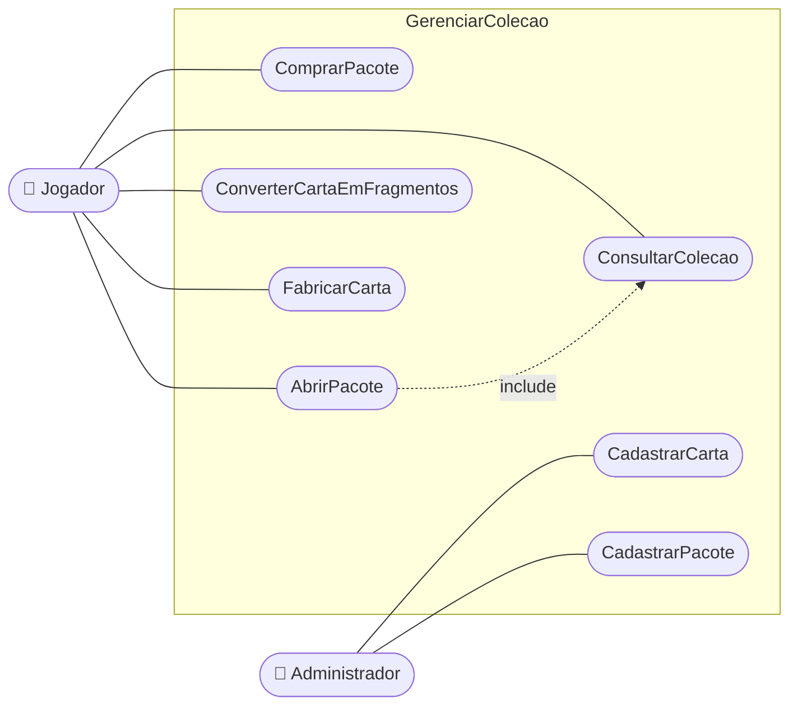

### II.4 Subsistema GerenciarDeck

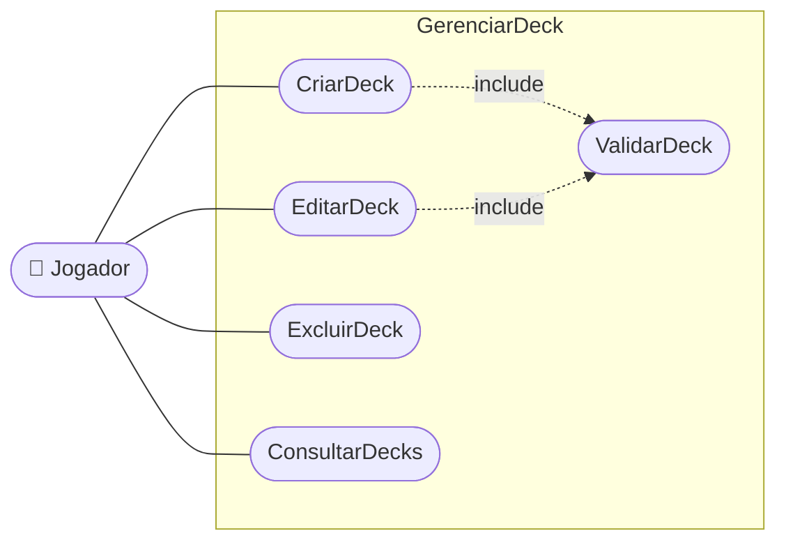

### II.5 Subsistema RealizarPartida

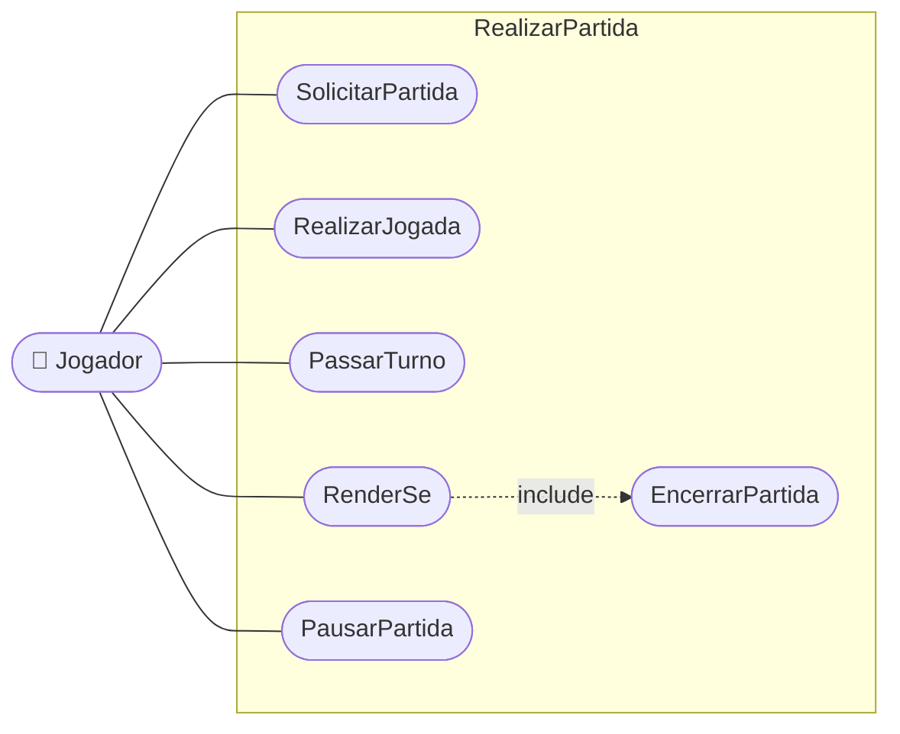

### II.6 Subsistema GerenciarCompeticao

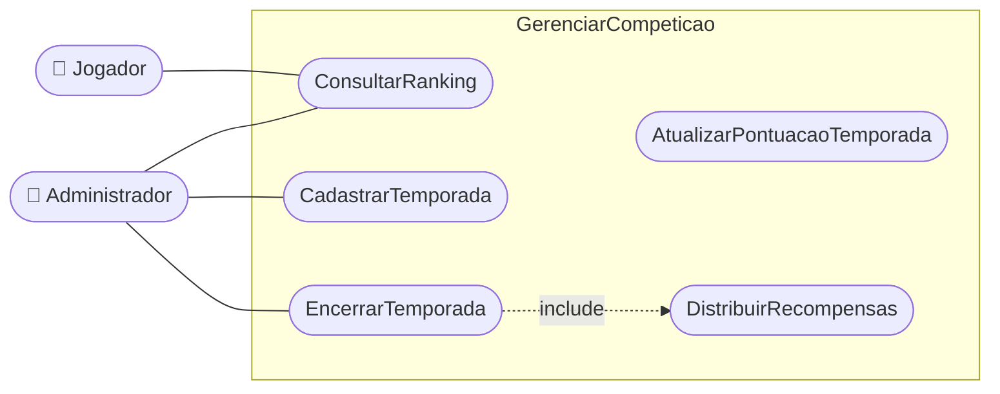

---

## ANEXO III — DESCRIÇÕES DOS CASOS DE USO (ANÁLISE)

### CDU-01 — CadastrarJogador

| Campo | Conteúdo |
|---|---|
| **Ator principal** | Jogador |
| **Objetivo** | Registrar uma nova pessoa no jogo, criando sua conta, seu saldo inicial de cristais e sua coleção inicial de cartas. |
| **Pré-condições** | O apelido e o e-mail informados ainda não estão em uso. |
| **Pós-condições** | Jogador cadastrado, com 500 cristais, o deck inicial e a coleção inicial de 30 cartas comuns. |

**Fluxo principal**
1. A pessoa solicita a criação de conta.
2. O sistema solicita apelido, nome completo, e-mail, data de nascimento, endereço, telefone,
   login e senha.
3. A pessoa informa os dados e confirma.
4. O sistema valida o formato do e-mail e a idade mínima de 13 anos.
5. O sistema verifica que o apelido, o e-mail e o login ainda não estão em uso.
6. O sistema grava o jogador e o usuário correspondente.
7. O sistema credita 500 cristais e concede a coleção inicial de cartas.
8. O sistema monta um deck inicial válido com as cartas concedidas.
9. O sistema confirma o cadastro e apresenta a tela de logon.

**Exceções**
- **E1 – Apelido, e-mail ou login já em uso:** informa qual campo está duplicado e retorna ao passo 2.
- **E2 – Idade inferior a 13 anos:** informa a restrição e encerra o caso de uso.

### CDU-02 — ComprarPacote

| Campo | Conteúdo |
|---|---|
| **Ator principal** | Jogador |
| **Objetivo** | Adquirir pacotes de cartas usando cristais. |
| **Pré-condições** | Jogador autenticado e pacote ativo na loja. |
| **Pós-condições** | Saldo de cristais debitado e pacotes creditados ao jogador. |

**Fluxo principal**
1. O jogador acessa a loja.
2. O sistema apresenta os pacotes ativos, com nome, expansão, quantidade de cartas e preço.
3. O jogador seleciona um pacote e informa a quantidade.
4. O sistema calcula o custo total e apresenta a confirmação.
5. O jogador confirma.
6. O sistema verifica o saldo de cristais.
7. O sistema debita o saldo e registra a compra.

**Exceções**
- **E1 – Saldo insuficiente:** informa o valor faltante e retorna ao passo 3.
- **E2 – Pacote desativado durante a operação:** informa a indisponibilidade e retorna ao passo 2.

### CDU-03 — AbrirPacote

| Campo | Conteúdo |
|---|---|
| **Ator principal** | Jogador |
| **Objetivo** | Revelar as cartas contidas em um pacote adquirido e incorporá-las à coleção. |
| **Pré-condições** | O jogador possui ao menos um pacote não aberto. |
| **Pós-condições** | Cartas sorteadas incorporadas à coleção; abertura registrada no histórico. |

**Fluxo principal**
1. O jogador seleciona um pacote não aberto e solicita a abertura.
2. O sistema sorteia a quantidade de cartas definida no pacote, respeitando a probabilidade de
   cada raridade e garantindo ao menos uma carta rara ou superior.
3. O sistema verifica, para cada carta sorteada, se o jogador já a possui.
4. O sistema incrementa a quantidade na coleção ou cria o item de coleção.
5. O sistema registra a abertura e as cartas sorteadas.
6. O sistema apresenta as cartas obtidas, destacando as inéditas.

**Fluxos alternativos**
- **A1 – Limite de cópias atingido:** no passo 4, se o jogador já possui o número máximo de cópias
  permitido, o sistema converte a carta em fragmentos automaticamente e informa o jogador.

### CDU-04 — EditarDeck

| Campo | Conteúdo |
|---|---|
| **Ator principal** | Jogador |
| **Objetivo** | Alterar a composição de um deck, respeitando as regras do formato e a posse das cartas. |
| **Pré-condições** | O deck pertence ao jogador autenticado. |
| **Pós-condições** | Deck gravado com a nova composição e com o totalizador de cartas atualizado. |

**Fluxo principal**
1. O jogador seleciona um deck e solicita a edição.
2. O sistema apresenta a coleção do jogador de um lado e a composição atual do deck do outro.
3. O jogador adiciona ou remove cartas.
4. Para cada adição, o sistema verifica se o jogador possui a quantidade de cópias pretendida e se
   o limite de cópias do formato é respeitado.
5. O sistema atualiza o totalizador de cartas e exibe o progresso em relação ao mínimo do formato.
6. O jogador solicita a gravação.
7. O sistema executa *ValidarDeck*.
8. O sistema grava o deck e a data da última alteração.

**Exceções**
- **E1 – Carta não possuída em quantidade suficiente:** informa a quantidade disponível e ignora a
  adição.
- **E2 – Deck inválido na gravação:** apresenta a lista de erros e retorna ao passo 3.

### CDU-05 — ValidarDeck

| Campo | Conteúdo |
|---|---|
| **Ator principal** | — (caso de uso incluído por CriarDeck e EditarDeck) |
| **Objetivo** | Verificar se um deck atende às regras do seu formato. |
| **Pré-condições** | Deck com formato definido. |
| **Pós-condições** | Resultado da validação produzido, com a lista de erros e de avisos. |

**Fluxo principal**
1. O sistema conta o total de cartas do deck.
2. O sistema verifica se o total está entre o mínimo e o máximo do formato.
3. O sistema verifica, carta a carta, se a quantidade de cópias não excede o máximo do formato.
4. O sistema verifica se o jogador ainda possui todas as cartas do deck na quantidade utilizada.
5. O sistema produz o resultado da validação.

### CDU-06 — SolicitarPartida

| Campo | Conteúdo |
|---|---|
| **Ator principal** | Jogador |
| **Objetivo** | Colocar o jogador em uma fila até que um oponente compatível seja encontrado e iniciar a partida. |
| **Pré-condições** | O jogador possui ao menos um deck válido. |
| **Pós-condições** | Partida criada com situação "Em Andamento" e dois participantes registrados. |

**Fluxo principal**
1. O jogador escolhe o modo (casual ou ranqueada) e o deck.
2. O sistema executa *ValidarDeck*.
3. O sistema insere o jogador na fila de espera do modo escolhido.
4. O sistema procura um oponente com pontuação próxima, no caso de partida ranqueada.
5. Ao encontrar o oponente, o sistema cria a partida com situação "Aguardando Oponente" e registra
   as duas participações.
6. O sistema sorteia quem inicia, distribui a mão inicial de 7 cartas a cada lado e altera a
   situação para "Em Andamento".
7. O sistema abre a mesa de partida para os dois jogadores.

**Exceções**
- **E1 – Deck inválido:** apresenta os erros e encerra o caso de uso.
- **E2 – Tempo de espera esgotado (5 minutos):** o sistema retira o jogador da fila, cancela a
  busca e informa que nenhum oponente foi encontrado.

### CDU-07 — RealizarJogada

| Campo | Conteúdo |
|---|---|
| **Ator principal** | Jogador |
| **Objetivo** | Executar uma ação dentro do turno: invocar criatura, lançar feitiço, posicionar terreno ou atacar. |
| **Pré-condições** | Partida em andamento e o jogador é o dono do turno corrente. |
| **Pós-condições** | Jogada registrada e estado da mesa atualizado para os dois jogadores. |

**Fluxo principal**
1. O jogador seleciona uma carta da mão ou uma criatura em campo e indica a ação e o alvo.
2. O sistema verifica se o jogador é o dono do turno corrente.
3. O sistema verifica se os recursos disponíveis cobrem o custo da carta.
4. O sistema verifica se o alvo é permitido para a carta escolhida.
5. O sistema aplica o efeito da jogada e debita os recursos.
6. O sistema registra a jogada no turno e atualiza a data da última jogada da partida.
7. O sistema verifica se a partida terminou; em caso afirmativo, executa *EncerrarPartida*.
8. O sistema envia o novo estado da mesa aos dois jogadores.

**Exceções**
- **E1 – Não é o turno do jogador:** a jogada é recusada e o estado permanece inalterado.
- **E2 – Recursos insuficientes:** informa o custo faltante e recusa a jogada.
- **E3 – Alvo inválido:** informa a restrição e recusa a jogada.

### CDU-08 — EncerrarPartida

| Campo | Conteúdo |
|---|---|
| **Ator principal** | — (incluído por RealizarJogada e RenderSe; disparado também pelo Temporizador) |
| **Objetivo** | Finalizar a partida, apurar o resultado e atualizar os dados dos jogadores. |
| **Pré-condições** | Partida em andamento ou pausada. |
| **Pós-condições** | Partida com situação "Encerrada", participações com resultado registrado, totalizadores dos jogadores atualizados e, se ranqueada, pontuação da temporada atualizada. |

**Fluxo principal**
1. O sistema identifica o vencedor e o motivo do encerramento.
2. O sistema grava o resultado nas duas participações.
3. O sistema altera a situação da partida para "Encerrada" e grava a data e a hora do fim.
4. O sistema incrementa os totalizadores de partidas e de vitórias dos jogadores.
5. O sistema concede a experiência e os cristais correspondentes ao resultado.
6. Se a partida for ranqueada, o sistema executa *AtualizarPontuacaoTemporada*.
7. O sistema apresenta a tela de resultado aos dois jogadores.

### CDU-09 — AtualizarPontuacaoTemporada

| Campo | Conteúdo |
|---|---|
| **Ator principal** | — (incluído por EncerrarPartida) |
| **Objetivo** | Somar ou subtrair os pontos do jogador na temporada corrente e reenquadrá-lo na divisão adequada. |
| **Pré-condições** | Existir temporada ativa e a partida ser ranqueada. |
| **Pós-condições** | Pontuação, acumuladores de vitórias e derrotas e divisão atualizados. |

**Fluxo principal**
1. O sistema localiza a temporada ativa.
2. O sistema localiza ou cria a pontuação do jogador nessa temporada.
3. O sistema soma 25 pontos ao vencedor e subtrai 15 pontos do perdedor, respeitando o piso de
   zero pontos.
4. O sistema incrementa o acumulador de vitórias ou de derrotas.
5. O sistema reenquadra o jogador na divisão correspondente à nova pontuação.
6. O sistema grava a pontuação.

### CDU-10 — ConsultarRanking

| Campo | Conteúdo |
|---|---|
| **Ator principal** | Jogador / Administrador |
| **Objetivo** | Exibir a classificação dos jogadores na temporada. |
| **Pré-condições** | Existir temporada cadastrada. |
| **Pós-condições** | — (consulta) |

**Fluxo principal**
1. O usuário solicita o ranking.
2. O sistema seleciona a temporada ativa, ou a temporada escolhida pelo usuário.
3. O sistema ordena as pontuações em ordem decrescente de pontos e, em caso de empate, por maior
   número de vitórias.
4. O sistema apresenta a página do ranking com posição, apelido, divisão, pontos, vitórias e
   derrotas, destacando a linha do próprio usuário.

---

## ANEXO IV — DIAGRAMA DE CLASSES DE ANÁLISE

Diagrama de Classes de Análise, anterior às decisões de projeto: sem visibilidade detalhada, sem
tipos de dados, com as classes de associação ainda representadas como tais, com o item de grupo
`endereco` e o atributo multivalorado `telefone*` ainda embutidos em `Jogador` e sem as classes
de apoio criadas no projeto.

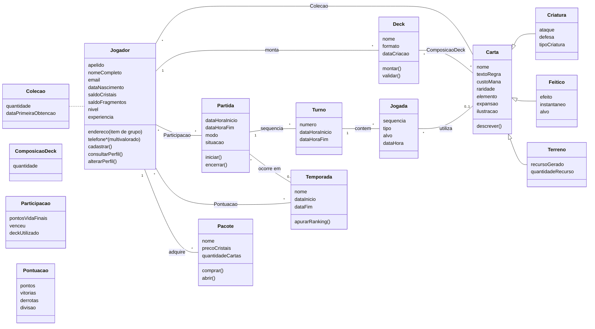

---

## ANEXO V — DIAGRAMA DE ESTADOS

**Classe a que pertence o Diagrama de Estados: `Partida`.**

```mermaid
stateDiagram-v2
  direction LR
  [*] --> AguardandoOponente : criarPartida()

  AguardandoOponente --> EmAndamento : oponenteEncontrado() / distribuirMaoInicial()
  AguardandoOponente --> Cancelada : tempoEsperaEsgotado()
  AguardandoOponente --> Cancelada : cancelarBusca()

  EmAndamento --> Pausada : solicitarPausa() [pausasRestantes > 0]
  Pausada --> EmAndamento : retomar()
  Pausada --> Encerrada : tempoPausaEsgotado() / derrotaPorAusencia()

  EmAndamento --> Encerrada : pontosVida <= 0 / apurarResultado()
  EmAndamento --> Encerrada : renderSe() / apurarResultado()
  EmAndamento --> Encerrada : tempoJogadaEsgotado() / derrotaPorAusencia()
  EmAndamento --> Encerrada : limiteTurnosAtingido() / empate()

  Encerrada --> [*]
  Cancelada --> [*]

  note right of EmAndamento
    Estado composto: alterna entre
    TurnoJogadorA e TurnoJogadorB
    a cada passarTurno()
  end note
```

**Estado composto `EmAndamento`**

```mermaid
stateDiagram-v2
  direction LR
  state EmAndamento {
    [*] --> TurnoJogadorA
    TurnoJogadorA --> TurnoJogadorB : passarTurno()
    TurnoJogadorB --> TurnoJogadorA : passarTurno()

    state TurnoJogadorA {
      [*] --> Compra
      Compra --> Recursos : cartaComprada()
      Recursos --> Acoes : recursosAcumulados()
      Acoes --> Acoes : realizarJogada()
      Acoes --> [*] : encerrarTurno()
    }
  }
```

---

# O QUE AINDA FALTA

Checklist do que **não** dá para eu fechar sozinho — precisa de você ou do grupo:

## Bloqueantes (antes de postar)

- [ ] **Confirmar com a professora se CC pode entregar um jogo.** O template separa a descrição
      do mini-mundo em "Para alunos de SI/TADS/CC" (descrever a área de negócio) e "Para os alunos
      de Jogos" (descrever o roteiro do jogo). Como o curso é Ciência da Computação, a proposta usa
      a linha de SI/TADS/CC, e o texto do mini-mundo descreve o funcionamento do domínio — serve
      para as duas leituras. Ainda assim, vale perguntar antes de seguir.
- [ ] **Organização, endereço e usuário** — Mesa Viva Studio, o endereço e o Mário de Souza são
      fictícios (o template pede uma organização e um usuário de contato). Se a professora cobrar
      cliente real, trocar pelos dados verdadeiros.

## Para a entrega da Especificação de Projeto

- [ ] **Renderizar os diagramas** — todos os blocos ```mermaid``` deste arquivo. Cole em
      <https://mermaid.live>, exporte PNG e substitua os quadros correspondentes no `.docx`.
      (O VS Code também renderiza com a extensão *Markdown Preview Mermaid Support*.)
- [ ] **Sumário** — no Word: Referências → Sumário → Sumário Automático. Os títulos já usam os
      estilos Título 1/2, então ele monta sozinho.
- [ ] **Seção 6.3 — telas do protótipo** — os esboços em ASCII são só o roteiro do que cada tela
      precisa ter. Substituir por prints reais do protótipo e escrever o passo-a-passo da execução.
- [ ] **Conferir com a professora** se ela quer o Diagrama de Casos de Uso no formato canônico da
      UML (boneco + elipse + retângulo de fronteira). Os meus estão em Mermaid, com formato de
      estádio no lugar de elipse. Se ela for rígida, refazer no Astah ou no draw.io — a estrutura
      (atores, casos de uso e subsistemas) já está toda definida aqui.

## Ajustes que valem a pena revisar

- [ ] **Escopo do protótipo** — o modelo tem 30+ classes. Para implementar, cortar para o núcleo:
      Jogador, Carta (+3 subclasses), ItemColecao, Deck, ItemDeck, Formato, Partida, Turno, Jogada.
      Loja, temporada e ranking podem ficar só na documentação.
- [ ] **Regras numéricas** — 500 cristais iniciais, mão de 7 cartas, +25/-15 pontos, 90 dias de
      corte do histórico, 30 min de abandono. São valores que eu arbitrei; ajustar se o grupo
      quiser outro balanceamento.
- [ ] **Referências bibliográficas** — o template cita Pressman (2002), Magela (1998), Falbo (2003)
      e Ambler. Se a professora pedir seção de referências, montar a partir desses.

## Onde o protótipo diverge da especificação

Registrado aqui para você citar na defesa, ou alinhar depois:

- **`LadoPartida`** — classe que não está no Diagrama de Classes do CDP. Guarda o estado de um
  jogador *durante* a partida (pontos de vida, mão, campo, monte). Na especificação esse estado
  está implícito em `Partida`; no código precisou virar classe. Vale acrescentar ao diagrama.
- **Persistência em memória** — `RepositorioMemoria` no lugar dos DAOs JDBC da seção 7.3. As
  interfaces já têm a forma do CGD projetado, então a troca não mexe no Model nem no Controller.
- **Cadastros básicos como `enum`** — `Raridade`, `Elemento`, `Formato`, `StatusPartida`,
  `ModoPartida` e `TipoJogada` estão como enum em vez de classes de cadastro. Em Java enum é
  classe, mas isso tira do administrador a possibilidade de manter esses dados sem recompilar,
  que é o que a seção 2.3 promete.
- **Formatos** — `PADRAO` está com 60 a 250 cartas e 3 cópias; `RAPIDO` com 20 a 40 e 2 cópias.
  Números arbitrados, ajustar se o grupo quiser outro balanceamento.
- **Combate simplificado** — o dano do lado atacante é somado e as criaturas defensoras absorvem
  na ordem em que estão no campo. Não há escolha de bloqueio nem de alvo pelo jogador.
- **Segurança, temporada e ranking** — especificados nas seções 3, 7 e 8, mas fora do protótipo.
